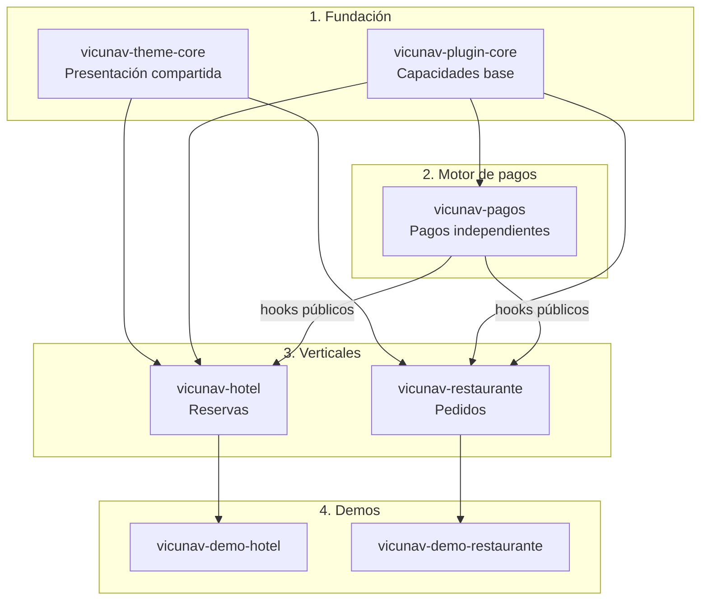

# vicunav-hub

`vicunav-hub` documenta la arquitectura y las decisiones del ecosistema Vicunav: un
conjunto modular de temas y plugins de WordPress para construir soluciones verticales
sin acoplar la presentación, la lógica de negocio ni los pagos.

Cada paquete vive en su propio repositorio, con historial, versión y README
independientes. Los paquetes se comunican mediante contratos y hooks públicos; ningún
plugin lee directamente la base de datos de otro.

## Arquitectura del ecosistema

Las capas separaron responsabilidades concretas:

1. **Fundación:** `vicunav-theme-core` aportó patrones, tokens y templates de
   presentación; `vicunav-plugin-core` concentró capacidades base compartidas. La lógica
   de negocio no vivió en el theme.
2. **Motor de pagos:** `vicunav-pagos` procesó pagos sin conocer reservas ni pedidos. Los
   verticales lo declararon mediante `Requires Plugins` y reaccionaron a sus hooks
   públicos. Un proyecto sin transacciones pudo omitirlo.
3. **Verticales:** `vicunav-hotel` y `vicunav-restaurante` encapsularon respectivamente
   reservas y pedidos, sin leer datos internos de otros plugins.
4. **Demos:** `vicunav-demo-hotel` y `vicunav-demo-restaurante` integraron las capas en
   sitios públicos de referencia.

Los repositorios de estándares, plantilla y documentación sostuvieron el desarrollo del
ecosistema, pero no formaron parte de sus capas de ejecución.

## Repositorios

| Repositorio | Propósito | Estado |
| --- | --- | --- |
| [`vicunav-standards`](https://github.com/vicunav/vicunav-standards) | Estándares técnicos compartidos del ecosistema. | Disponible |
| [`vicunav-repo-template`](https://github.com/vicunav/vicunav-repo-template) | Plantilla base para inicializar repositorios. | Disponible |
| [`vicunav-hub`](https://github.com/vicunav/vicunav-hub) | Documentación de arquitectura y decisiones del ecosistema. | Disponible |
| `vicunav-theme-core` | Patrones, tokens y templates de presentación compartidos. | Pendiente |
| `vicunav-plugin-core` | Capacidades base compartidas por los plugins. | Pendiente |
| `vicunav-pagos` | Motor de pagos independiente de los verticales. | Pendiente |
| `vicunav-hotel` | Lógica del vertical hotelero y sus reservas. | Pendiente |
| `vicunav-restaurante` | Lógica del vertical de restaurante y sus pedidos. | Pendiente |
| `vicunav-demo-hotel` | Demostración pública del vertical hotelero. | Pendiente |
| `vicunav-demo-restaurante` | Demostración pública del vertical de restaurante. | Pendiente |

## Decisiones de arquitectura

- [ADR 0001: Separación entre theme y plugins](docs/adr/0001-separacion-theme-plugins.md)
- [ADR 0002: Pagos como motor independiente](docs/adr/0002-pagos-motor-independiente.md)
- [ADR 0003: Contratos frontera y eventos](docs/adr/0003-contratos-y-eventos.md)
- [ADR 0004: Estructura de repositorios](docs/adr/0004-estructura-de-repos.md)

## Licencia

La documentación de este repositorio se distribuye bajo
[Creative Commons Attribution 4.0 International](LICENSE).
