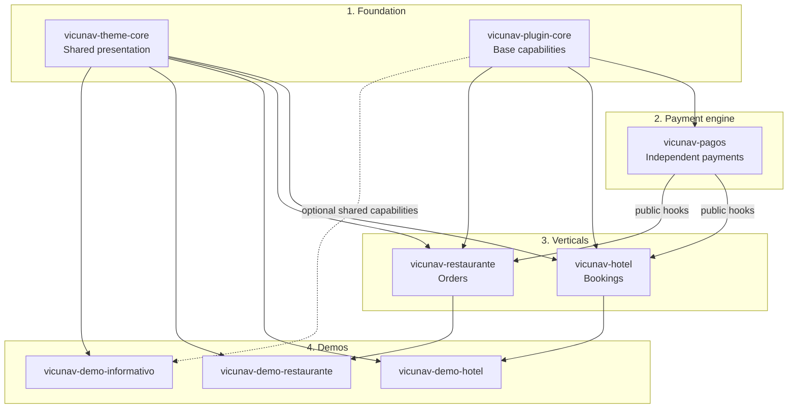

# vicunav-hub

`vicunav-hub` documents the architecture and decisions of the Vicunav ecosystem: a
modular set of WordPress themes and plugins for building vertical solutions without
coupling presentation, business logic, or payments.

Each package lives in its own repository, with independent history, version, and README.
Packages communicate through public contracts and hooks; no plugin reads another's
database directly.

## Ecosystem architecture

```mermaid
flowchart TB
    subgraph foundation["1. Foundation"]
        theme["vicunav-theme-core<br/>Shared presentation"]
        plugin["vicunav-plugin-core<br/>Base capabilities"]
    end

    subgraph payments["2. Payment engine"]
        payment["vicunav-pagos<br/>Independent payments"]
    end

    subgraph verticals["3. Verticals"]
        hotel["vicunav-hotel<br/>Bookings"]
        restaurant["vicunav-restaurante<br/>Orders"]
    end

    subgraph demos["4. Demos"]
        demo_info["vicunav-demo-informativo"]
        demo_hotel["vicunav-demo-hotel"]
        demo_restaurant["vicunav-demo-restaurante"]
    end

    plugin --> payment
    theme --> hotel
    theme --> restaurant
    plugin --> hotel
    plugin --> restaurant
    payment -->|public hooks| hotel
    payment -->|public hooks| restaurant
    theme --> demo_hotel
    theme --> demo_restaurant
    theme --> demo_info
    plugin -.->|optional shared capabilities| demo_info
    hotel --> demo_hotel
    restaurant --> demo_restaurant
```

The layers separate concrete responsibilities:

1. **Foundation:** `vicunav-theme-core` provides presentation patterns, tokens, and
   templates; `vicunav-plugin-core` concentrates shared base capabilities. Business
   logic does not live in the theme.
2. **Payment engine:** `vicunav-pagos` processes payments without knowing about
   bookings or orders. Verticals declare it through `Requires Plugins` and react to its
   public hooks. A project without transactions can omit it.
3. **Verticals:** `vicunav-hotel` and `vicunav-restaurante` encapsulate bookings and
   orders respectively, without reading another plugin's internal data.
4. **Demos:** `vicunav-demo-informativo` validates the foundation in a
   non-transactional professional site. `vicunav-demo-hotel` and
   `vicunav-demo-restaurante` integrate the foundation with their corresponding
   verticals. A demo composes only the layers it needs.

The standards, template, documentation, and migration-tooling repositories support
the ecosystem's development, but are not part of its execution layers.

## Repositories

| Repository | Purpose | Status |
| --- | --- | --- |
| [`vicunav-standards`](https://github.com/vicunav/vicunav-standards) | Shared technical standards for the ecosystem. | Available |
| [`vicunav-repo-template`](https://github.com/vicunav/vicunav-repo-template) | Base template to bootstrap new repositories. | Available |
| [`vicunav-hub`](https://github.com/vicunav/vicunav-hub) | Architecture, decisions, current state, and roadmap. | Active |
| [`vicunav-transform-claude-to-gutenberg`](https://github.com/vicunav/vicunav-transform-claude-to-gutenberg) | Agent skill for translating approved Claude Code prototypes into native Gutenberg FSE themes. | Available |
| [`vicunav-theme-core`](https://github.com/vicunav/vicunav-theme-core) | Shared presentation patterns, tokens, and templates. | Foundation complete |
| [`vicunav-plugin-core`](https://github.com/vicunav/vicunav-plugin-core) | Shared content, settings, security, and REST capabilities. | Foundation complete |
| [`vicunav-pagos`](https://github.com/vicunav/vicunav-pagos) | Payment engine independent of the verticals. | Initial foundation complete |
| `vicunav-restaurante` | Restaurant vertical logic and its orders. | Pending |
| `vicunav-hotel` | Hotel vertical logic and its bookings. | Deferred by ADR 0006 |
| `vicunav-demo-restaurante` | Public demo of the restaurant vertical. | Pending |
| `vicunav-demo-hotel` | Public demo of the hotel vertical. | Pending |
| `vicunav-demo-informativo` | Professional, non-transactional reference demo built on the shared theme. | Planned; Dra. Fortul is the private reference implementation |

The next executable step is to implement the payment state machine, expiration,
idempotency, and public lifecycle events in `vicunav-pagos`. The
[current state](docs/handoff/estado-ecosistema.md) explains what is already implemented,
while the [ecosystem backlog](docs/handoff/backlog-ecosistema.md) defines the remaining
order and dependencies.

## Development tooling

[`vicunav-transform-claude-to-gutenberg`](https://github.com/vicunav/vicunav-transform-claude-to-gutenberg)
provides a reusable Agent Skill and deterministic validators for moving an approved
React, Next.js, Vite, HTML, or CSS prototype into an editable WordPress block theme.
It supports the design tracks for the demos without becoming a runtime dependency of
their themes, plugins, or published sites.

## Related projects outside the ecosystem

[`vicunav-gutenberg`](https://github.com/vicunav/vicunav-gutenberg) migrates the
current `vicunav.com` site from Elementor to Gutenberg FSE and serves as a practical
test bed for refining that migration workflow. It is managed independently and is not
one of the packages, verticals, or demos governed by this hub.

[`vicunav-web`](https://github.com/vicunav/vicunav-web) is Vicunav's own site: a block
theme FSE built from scratch, per [ADR 0012](docs/adr/0012-sitio-propio-vicunav-web.md).
It owns its brand tokens directly in its `theme.json` and does not depend on
`vicunav-theme-core`. It runs in parallel with `vicunav-gutenberg`, without a
dependency relationship between the two.

## Architecture decisions

- [ADR 0001: Separation between theme and plugins](docs/adr/0001-separacion-theme-plugins.md)
- [ADR 0002: Payments as an independent engine](docs/adr/0002-pagos-motor-independiente.md)
- [ADR 0003: Boundary contracts and events](docs/adr/0003-contratos-y-eventos.md)
- [ADR 0004: Repository structure](docs/adr/0004-estructura-de-repos.md)
- [ADR 0005: Genuine ACF for fields only](docs/adr/0005-acf-genuino-solo-campos.md)
- [ADR 0006: Restaurant first](docs/adr/0006-restaurante-primero.md)
- [ADR 0007: Informational demo on the shared foundation](docs/adr/0007-demo-informativo-theme-base.md)
- [ADR 0008: Claude Code to Gutenberg migration skill](docs/adr/0008-skill-claude-gutenberg.md)
- [ADR 0012: Vicunav's own site in a new repository](docs/adr/0012-sitio-propio-vicunav-web.md)

## Governance and roadmap

- [Decision and propagation workflow](docs/gobernanza.md)
- [Canonical ecosystem state](docs/handoff/estado-ecosistema.md)
- [Multi-repository backlog](docs/handoff/backlog-ecosistema.md)

## License

The documentation in this repository is distributed under
[Creative Commons Attribution 4.0 International](LICENSE).
