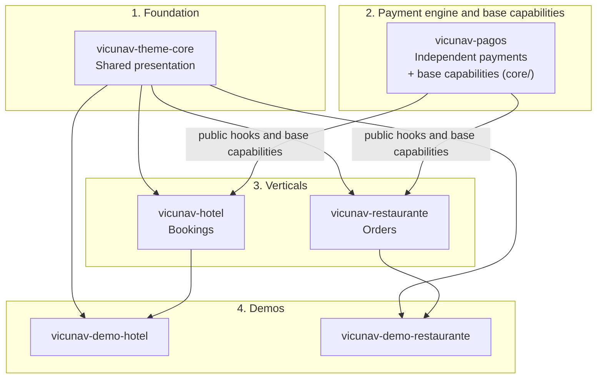

# vicunav-hub

`vicunav-hub` documents the architecture and decisions of the Vicunav ecosystem: a
modular set of WordPress themes and plugins for building vertical solutions without
coupling presentation, business logic, or payments.

Each package lives in its own repository, with independent history, version, and README.
Packages communicate through public contracts and hooks; no plugin reads another's
database directly.

## Ecosystem architecture

```mermaid
flowchart TB
    subgraph foundation["1. Foundation"]
        theme["vicunav-theme-core<br/>Shared presentation"]
    end

    subgraph payments["2. Payment engine and base capabilities"]
        payment["vicunav-pagos<br/>Independent payments<br/>+ base capabilities (core/)"]
    end

    subgraph verticals["3. Verticals"]
        hotel["vicunav-hotel<br/>Bookings"]
        restaurant["vicunav-restaurante<br/>Orders"]
    end

    subgraph demos["4. Demos"]
        demo_hotel["vicunav-demo-hotel"]
        demo_restaurant["vicunav-demo-restaurante"]
    end

    theme --> hotel
    theme --> restaurant
    payment -->|public hooks and base capabilities| hotel
    payment -->|public hooks and base capabilities| restaurant
    theme --> demo_hotel
    theme --> demo_restaurant
    hotel --> demo_hotel
    restaurant --> demo_restaurant
```

The layers separate concrete responsibilities:

1. **Foundation:** `vicunav-theme-core` provides presentation patterns, tokens, and
   templates. Business logic does not live in the theme. The shared base capabilities
   (`Vicu\Core`: content types, settings, security, REST) ship inside `vicunav-pagos`,
   in its `core/` folder.
2. **Payment engine:** `vicunav-pagos` processes payments without knowing about
   bookings or orders. Verticals declare it through `Requires Plugins` and react to its
   public hooks. It also distributes the base capabilities of the foundation layer.
3. **Verticals:** `vicunav-hotel` and `vicunav-restaurante` encapsulate bookings and
   orders respectively, without reading another plugin's internal data.
4. **Demos:** `vicunav-demo-hotel` and `vicunav-demo-restaurante` integrate the
   foundation with their corresponding verticals. A demo composes only the layers it
   needs.

The standards, template, and documentation repositories support the ecosystem's
development, but are not part of its execution layers.

## Repositories

| Repository | Purpose | Status |
| --- | --- | --- |
| [`vicunav-standards`](https://github.com/vicunav/vicunav-standards) | Shared technical standards for the ecosystem. | Available |
| [`vicunav-repo-template`](https://github.com/vicunav/vicunav-repo-template) | Base template to bootstrap new repositories. | Available |
| [`vicunav-hub`](https://github.com/vicunav/vicunav-hub) | Architecture, decisions, current state, and roadmap. | Active |
| [`vicunav-theme-core`](https://github.com/vicunav/vicunav-theme-core) | Shared presentation patterns, tokens, and templates. | Foundation complete |
| [`vicunav-pagos`](https://github.com/vicunav/vicunav-pagos) | Payment engine independent of the verticals; also ships the shared base capabilities (`Vicu\Core`). | Engine complete |
| [`vicunav-restaurante`](https://github.com/vicunav/vicunav-restaurante) | Restaurant vertical logic and its orders. | Runtime 1.0.0 candidate |
| `vicunav-hotel` | Hotel vertical logic and its bookings. | Deferred by ADR 0006 |
| [`vicunav-demo-restaurante`](https://github.com/vicunav/vicunav-demo-restaurante) | Public demo of the restaurant vertical. | Visual rework in progress |
| `vicunav-demo-hotel` | Public demo of the hotel vertical. | Deferred |
| [`vicunav-github-profile`](https://github.com/vicunav/vicunav-github-profile) | Public GitHub organization profile. | Available |

The next executable step is to recover the restaurant demo's 1:1 visual fidelity and
close its checkpoint. The
[current state](docs/handoff/estado-ecosistema.md) explains what is already implemented,
while the [ecosystem backlog](docs/handoff/backlog-ecosistema.md) defines the remaining
order and dependencies.

## Related projects outside the ecosystem

[`vicunav-gutenberg`](https://github.com/vicunav/vicunav-gutenberg) migrates the
current `vicunav.com` site from Elementor to Gutenberg FSE. It is managed
independently and is not one of the packages, verticals, or demos governed by this hub.

`vicunav-bhoga-yoga` is a private client implementation (the real Bhoga Yoga site). It
is built with `vicunav-theme-core`, the base capabilities shipped in `vicunav-pagos`,
and its own child theme; it is not a reusable package of the ecosystem
([ADR 0011](docs/adr/0011-bhoga-yoga-cliente-privado.md)).

## Architecture decisions

- [ADR 0001: Separation between theme and plugins](docs/adr/0001-separacion-theme-plugins.md)
- [ADR 0002: Payments as an independent engine](docs/adr/0002-pagos-motor-independiente.md)
- [ADR 0003: Boundary contracts and events](docs/adr/0003-contratos-y-eventos.md)
- [ADR 0004: Repository structure](docs/adr/0004-estructura-de-repos.md)
- [ADR 0005: Genuine ACF for fields only](docs/adr/0005-acf-genuino-solo-campos.md)
- [ADR 0006: Restaurant first](docs/adr/0006-restaurante-primero.md)
- [ADR 0009: Restaurant commerce without WooCommerce](docs/adr/0009-restaurante-sin-woocommerce.md)
- [ADR 0010: Blocking 1:1 visual fidelity for Gutenberg migrations](docs/adr/0010-fidelidad-visual-bloqueante.md)
- [ADR 0011: Bhoga Yoga as a private client implementation](docs/adr/0011-bhoga-yoga-cliente-privado.md)
- [ADR 0013: Dynamic, agnostic, shared theme-core](docs/adr/0013-theme-core-dinamico-agnostico.md) (superseded by 0015)
- [ADR 0015: One theme and one plugin per project](docs/adr/0015-un-theme-y-un-plugin-por-proyecto.md)

ADR numbers 0007, 0008, 0012, and 0014 are not reused.

## Governance and roadmap

- [Plan: one theme and one plugin per project](docs/handoff/plan-un-theme-y-plugin-por-proyecto.md) ([ADR 0015](docs/adr/0015-un-theme-y-un-plugin-por-proyecto.md))
- [Decision and propagation workflow](docs/gobernanza.md)
- [Canonical ecosystem state](docs/handoff/estado-ecosistema.md)
- [Multi-repository backlog](docs/handoff/backlog-ecosistema.md)

## License

The documentation in this repository is distributed under
[Creative Commons Attribution 4.0 International](LICENSE).
